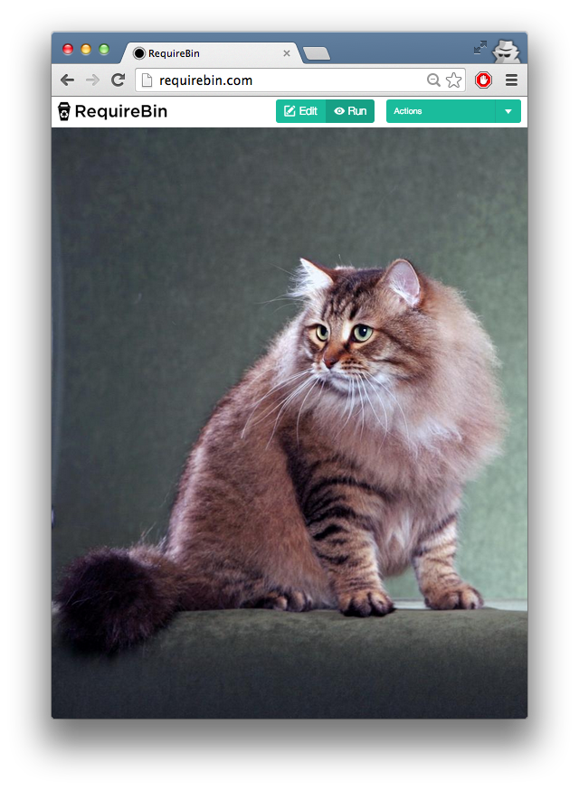

# cat-picture

makes a cat picture appear on your web site

simply `require('cat-picture')` to make it happen

[](https://ci.testling.com/maxogden/cat-picture)

## usage

```js
require('cat-picture')
```

## demo

[try it on requirebin](http://requirebin.com/?gist=9522894)

does this:



